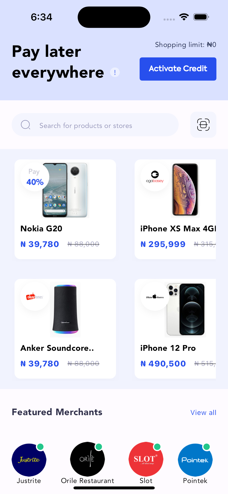
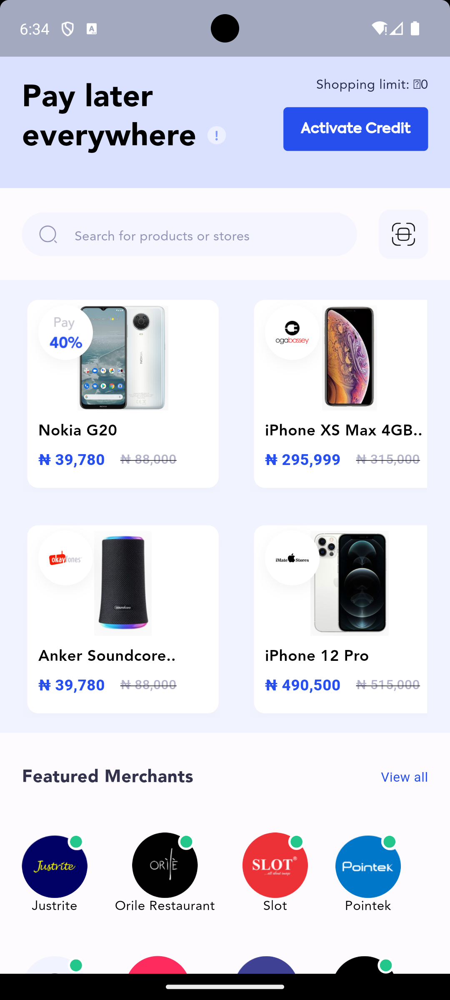
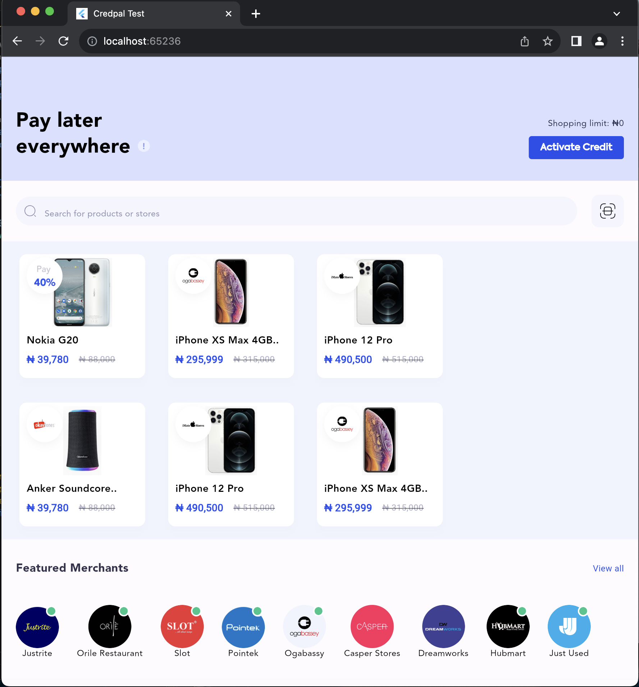

# credpal_test

A new Flutter project.

## Getting Started

This project is a starting point for a Flutter application.

Here are the screenshots of required interfaces:

- [Sample Figma Design](https://www.figma.com/file/KZKDiLKAnm04rPAKMx350o/Untitled?node-id=1%3A434&mode=dev)
- 
- 
- 

For help getting started with Flutter development, view the
[online documentation](https://docs.flutter.dev/), which offers tutorials,
samples, guidance on mobile development, and a full API reference.
